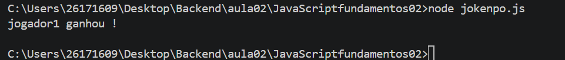

# JavaScript - Condições e laços de Repetição

## Objetivo

Ao final desta aula, aluno será capaz de:

* Compeender como funciona estruturas condicionais.
* ultilizar operadores de comparação e operadores lógicos.
* Desenvolver algoritimos ultilizando `if`, `else` e .`else if`
* ultilizar a estrutura `switch`
* Criar repetições `for`, `while`e `do...while`.
* resolver problema ultilizando lógica de programação.

---

### Conteúdo

### Estrutura condicionais

* if
* else
* else if
* switch
* Operadores de comparação
* Operadores lógicos

### Laços de Repetição

* for
* while
* do...while
* break
* continue

### Arrays

* push() Adiciona ao final
* pop () Remove o ultimo
* unshft() Adiciona ao inicio
* shift() Remove o primeiro
* length Quantidade de elementos
* at() Acessa uma posição

## Como executar

```bash
   git clone ""
```
Entre na pasta

```bash
cd JavaScriptFundamentos02
```
execute qualquer arquivo JavaScript

```bash
node jokenpo.js
```



## Exemplos desenvolvidos

Durante a aula foram implementados exemplos como:

* Verificar Maioridade.
* Calcular aprovação do aluno.
* Classificar idade.
* Menu utilizado switch.
* Contagem crescente.
* Contagem regressiva.

## Exercícios

* Estruturas condicionais
* Operadores lógicos
* Estrutura de repetição
* Problemas utilizando lógica de programação
* Desafio final integrando todos os conceitos estudados.

## Tecnologias 
* JavaScript (ES2023).
* Node.js
* Visual Studio Code

## Competência desenvolvida

* Lógica de programação
* Tomada de decição
* Estruturas condicionais
* Organização de algoritimos
* Resolução de problemas


## Material de apoio

* JavaScript
* Node.js
* MND web Docs